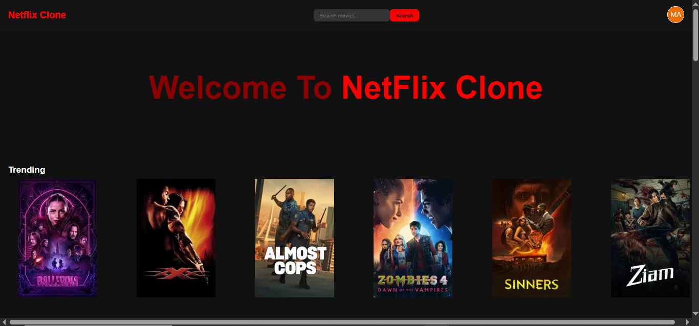
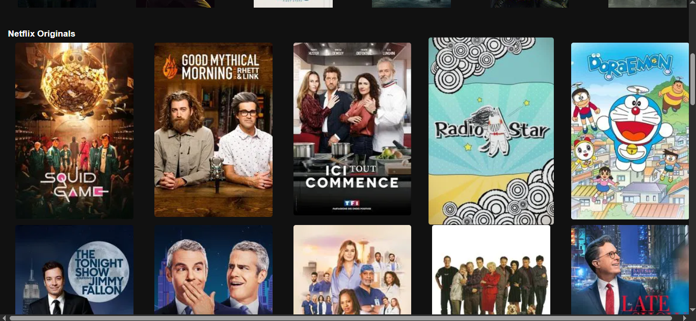
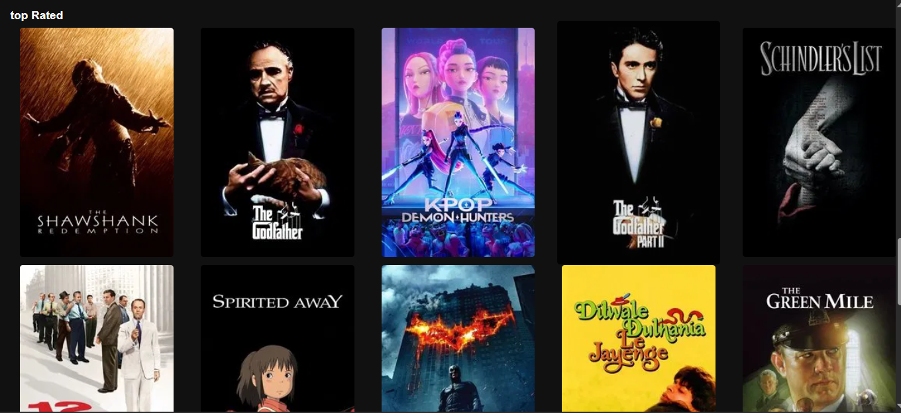
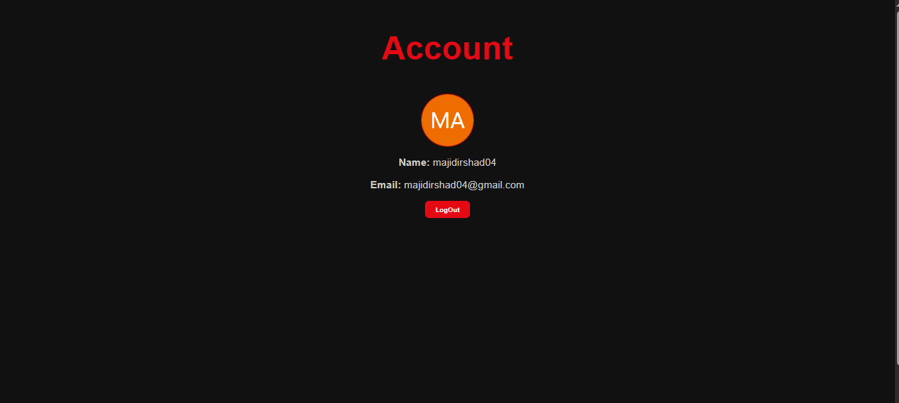
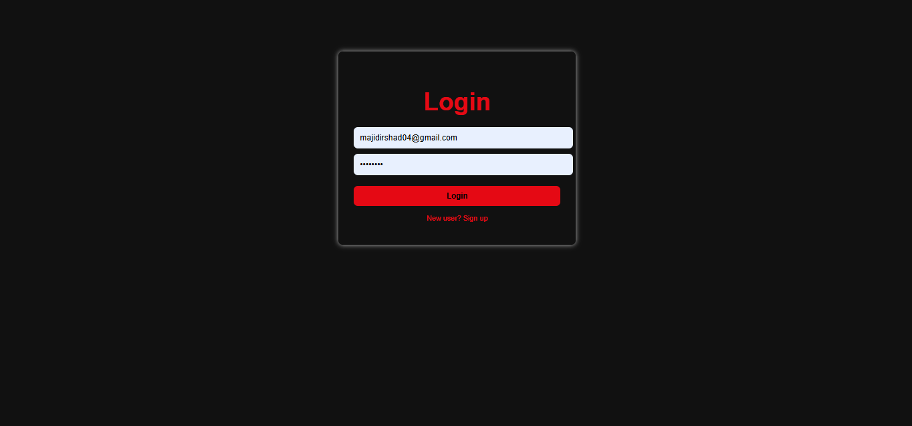
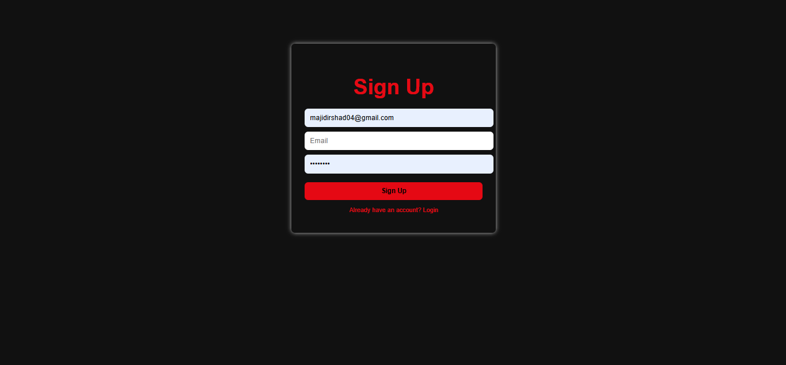

# 🎬 Netflix Clone

This is a **Netflix Clone UI** built using React.js that allows users to:
- View Top Rated, Trending, and Netflix Originals movies
- Search for specific movies
- Sign up, login, and manage user profiles with avatars

---

## 📸 Screenshots

### 🏠 Home Page

#### 🟥 This is from **Trending**

#### 🎬 This is from **Netflix Originals**

#### ⭐ This is from **Top Rated**

---

### 👤 Profile Page

Includes:
- Centered Avatar  
- User's Name & Email  
- Logout Button

|  |

---

### 🔐 Authentication Pages

#### ✅ Login Page

- Email and Password input fields  
- Link to Sign Up if user is new

|  |

#### 🆕 Sign Up Page

- New user registration  
- Generates random avatar using API

|  |

---

## ✨ Features

- 🔎 **Search** movies by title  
- 📈 **Trending Movies** section  
- ⭐ **Top Rated** movies section  
- 🎬 **Netflix Originals** row  
- 👤 User **Profiles** with avatars  
- 🔐 **Login / Sign Up** pages with form validation

---

## 🔌 APIs Used

- 📡 **TMDB API** – For fetching movies:  
  [https://www.themoviedb.org/documentation/api](https://www.themoviedb.org/documentation/api)

- 🧑‍🎨 **Avatar API** – For user avatars:  
  [https://avatars.dicebear.com/](https://avatars.dicebear.com/)

---

## 💻 Tech Stack

- React.js  
- CSS (Flexbox/Grid)  
- React Router  
- Axios for API calls

---

## 🧠 Author

Majid Ali  
Frontend Developer | Dreamer | Hard Worker  
_“Code smart, dream big.”_

---

